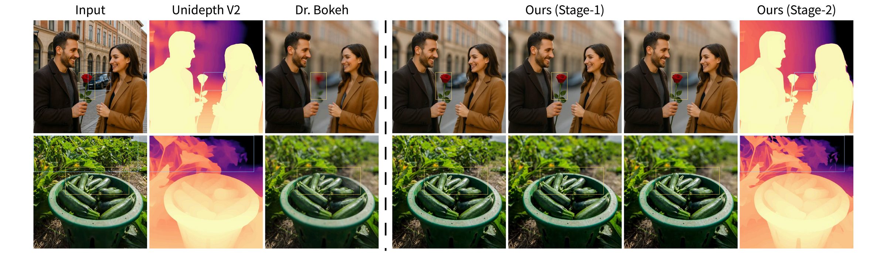
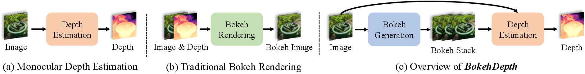
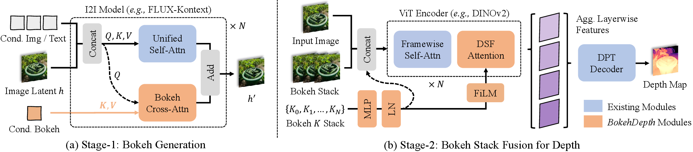

# BokehDepth: Boosting Monocular Metric Depth Estimation via Bokeh Rendering

<p align="center">
  <b>ICML 2026</b>
</p>

<p align="center">
  <a href="https://fogradio.github.io/BokehDepth_Project/"></a>
  <a href="#citation"></a>
  
</p>

<p align="center">
  Hangwei Zhang<sup>1,2</sup>&nbsp;&nbsp;
  Armando Teles Fortes<sup>1</sup>&nbsp;&nbsp;
  Tianyi Wei<sup>1</sup>&nbsp;&nbsp;
  Xingang Pan<sup>1</sup>
</p>

<p align="center">
  <sup>1</sup>S-Lab, Nanyang Technological University&nbsp;&nbsp;&nbsp;
  <sup>2</sup>Beihang University
</p>

<p align="center">
  
</p>

> **BokehDepth** decouples bokeh synthesis from depth prediction and uses lens-aware defocus as a *supervision-free* geometric cue to improve the accuracy and physical consistency of monocular metric depth estimation. **Left:** conventional pipelines predict depth from a single sharp image and render bokeh from a noisy depth map. **Right:** our two-stage framework — Stage-1 generates a calibrated bokeh stack from a single image, and Stage-2 fuses the induced defocus cues to produce sharper, more reliable metric depth.

---

## Overview

Bokeh rendering and depth estimation share a fundamental optical connection, yet existing methods fail to fully exploit this reciprocity:

- **Conventional bokeh pipelines** rely heavily on noisy depth maps, which translate any local depth error into incorrect blur radii, halos, and broken occlusion edges.
- **Monocular depth models** follow two flawed paradigms: generative diffusion frameworks lack consistent metric scale, while feed-forward metric models fail in textureless or distant regions — exactly where defocus blur could supply geometric information.

We propose **BokehDepth**, a two-stage framework that treats synthetic defocus as a *supervision-free geometric signal*. A physically grounded generative model produces calibrated bokeh stacks from a single sharp input (no depth map required), and a lightweight defocus-aware aggregation module integrates these stacks into a depth estimator's encoder while leaving the decoder unchanged.

<p align="center">
  
</p>

<p align="center">
  <em>(a) Standard monocular depth estimation predicts a depth map from a single RGB image. (b) Classical bokeh rendering takes an image and its depth map as input. (c) BokehDepth first generates a calibrated bokeh stack from the input image, then uses the induced defocus cues to enhance depth estimation.</em>
</p>

## Method

<p align="center">
  
</p>

**(a) Stage-1 — Physically Grounded Bokeh Generation.**
We build on **FLUX.1-Kontext**, a rectified-flow MMDiT backbone, and augment it with a *bokeh cross-attention adapter*. Diverse optical parameters (focal length, aperture, focus distance) are mapped to a single calibrated scalar `K` derived from the thin-lens circle-of-confusion model, which approximates the linear relation between blur radius and disparity offset (`r ≈ K · Δdisp`). Conditioned on `K`, Stage-1 generates a multi-strength bokeh stack from a single sharp image **without any depth map**. Training unifies three data sources — in-the-wild defocused photos with EXIF metadata, BokehMe-rendered augmentations, and paired datasets (DPDD, BLB) — into the shared `K` domain.

**(b) Stage-2 — Bokeh Stack Fusion for Depth.**
A **Divided Space Focus Attention (DSFA)** module is inserted into a ViT depth encoder:

- **Step-1 (Spatial attention):** attends within each frame, conditioned on the bokeh strength `K_f`.
- **Step-2 (Focus attention):** attends across frames at aligned spatial locations using FiLM conditioning, letting each location directly compare how blur changes with `K` — the physical depth-from-defocus cue.

Only the refined reference-frame tokens are kept, so the unchanged DPT decoder and metric head run exactly as in a standard single-frame estimator. This makes DSFA **plug-and-play** for strong depth foundations such as Depth Anything V2 and UniDepthV2.

> We further prove a *Depth-from-Bokeh Sweep* proposition: under calibrated bokeh control, regressing the bokeh radius on `K` across the stack yields an unbiased, consistent estimate of each pixel's inverse-depth offset — directly recovering metric depth.

## Highlights

- **Depth-map-free bokeh.** A physically calibrated, controllable bokeh generator that needs no depth map at inference.
- **Supervision-free geometric cue.** Synthetic defocus acts as an auxiliary signal that resolves geometric ambiguity in textureless and distant regions.
- **Plug-and-play.** DSFA drops into existing ViT depth encoders without modifying the decoder, loss, or evaluation pipeline.
- **Consistent gains.** Improves visual bokeh fidelity over depth-based baselines and boosts SOTA depth models in both in-domain and zero-shot settings.

## Code Release

The official code and pretrained models will be released soon. Please star this repository and check the [project page](https://fogradio.github.io/BokehDepth_Project/) for updates.

## Citation

If you find our work useful, please consider citing:

```bibtex
@inproceedings{zhang2026bokehdepth,
  title     = {Boosting Monocular Metric Depth Estimation via Bokeh Rendering},
  author    = {Zhang, Hangwei and Fortes, Armando Teles and Wei, Tianyi and Pan, Xingang},
  booktitle = {International Conference on Machine Learning (ICML)},
  year      = {2026}
}
```

## Acknowledgement

This research is supported by the National Research Foundation, Singapore, under its NRF Fellowship Award NRF-NRFF16-2024-0003 and NTU SUG-NAP, and by cash and in-kind funding from NTU S-Lab and industry partner(s). We build upon [FLUX.1-Kontext](https://github.com/black-forest-labs/flux), [Depth Anything V2](https://github.com/DepthAnything/Depth-Anything-V2), [UniDepthV2](https://github.com/lpiccinelli-eth/UniDepth), and [BokehMe](https://github.com/JuewenPeng/BokehMe).

## License

This project is released under the license specified in [LICENSE](LICENSE).
